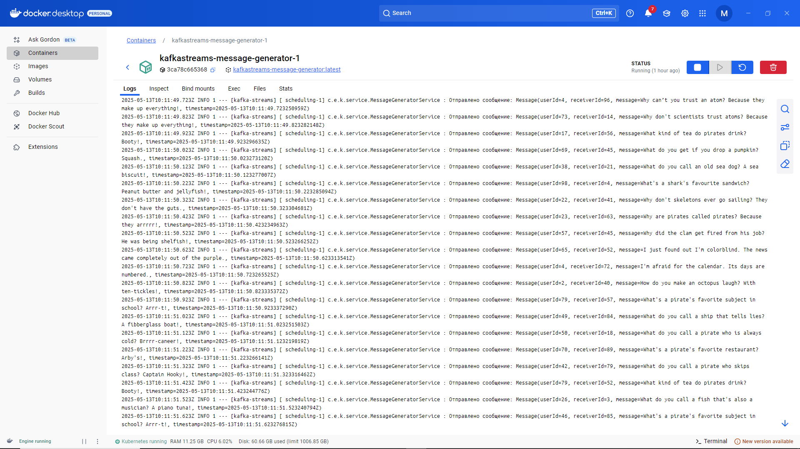

## Описание решения  

Этот проект реализует систему обработки потока сообщений с функциональностью блокировки пользователей и цензуры сообщений, используя Kafka Streams, Spring Boot и Java.  

### Общее описание проекта  

Проект разворачивается в Docker (Docker Compose) посредством запуска [docker-compose.yml](docker-compose.yml).  

В нём описаны необходимые инфраструктурные компоненты — сервис `Zookeeper` для координации кластера Kafka и собственно брокер Kafka, сконфигурированные для локальной работы с минимальной репликацией и простыми настройками. Для удобства мониторинга кластера и сообщений предусмотрен отдельный сервис `Kafka UI`, обеспечивающий веб-интерфейс для взаимодействия с Kafka.  

Кроме инфраструктуры, в конфигурации определены два пользовательских сервиса, реализованных на Spring Boot и построенных из одного и того же [Dockerfile](Dockerfile). Первый — генератор сообщений, который периодически формирует и отправляет события в определённый Kafka топик, служащий источником данных для тестирования и демонстрации. Второй — процессор сообщений, который потребляет данные из топика, выполняет их обработку (фильтрацию, цензуру и другие бизнес-правила) и отправляет результат в отдельный топик для дальнейшего использования.  

Разделение на профили Spring (`generator` и `processor`) позволяет запускать один и тот же контейнер с разной логикой без дублирования образов. Вся коммуникация между сервисами происходит через Kafka топики, обеспечивая надёжный обмен сообщениями и масштабируемость всей системы. Хранение данных Kafka осуществляется на отдельном томе, что гарантирует сохранность состояния при перезапуске контейнеров.  

### Структура каталогов проекта  

```
kafkastreams/
├── .gitattributes
├── .gitignore
├── .gradle/
├── build/
├── build.gradle
├── docker-compose.yml
├── Dockerfile
├── gradle/
│   └── wrapper/
│       ├── gradle-wrapper.jar
│       └── gradle-wrapper.properties
├── gradlew
├── gradlew.bat
├── README.md
├── settings.gradle
├── src/
│   ├── main/
│   │   ├── java/
│   │   │   └── com/
│   │   │       └── example/
│   │   │           └── kafkastreams/
│   │   │               ├── KafkaStreamsApplication.java
│   │   │               ├── config/
│   │   │               │   ├── KafkaConfig.java
│   │   │               │   ├── KafkaStreamsConfig.java
│   │   │               │   └── KafkaStreamsProcessor.java
│   │   │               ├── controller/
│   │   │               │   ├── BlockedUserController.java
│   │   │               │   └── CensorshipController.java
│   │   │               ├── listener/
│   │   │               │   └── MessageListener.java
│   │   │               ├── model/
│   │   │               │   └── Message.java
│   │   │               └── service/
│   │   │                   ├── BlockedUserService.java
│   │   │                   ├── CensorshipService.java
│   │   │                   └── MessageGeneratorService.java
│   │   └── resources/
│   │       ├── application.properties
│   │       ├── blocked_users.json
│   │       ├── censored_words.txt
│   │       └── messages.txt
│   └── test/
│       └── java/
│           └── com/
│               └── example/
│                   └── kafkastreams/
│                       └── KafkaStreamsApplicationTests.java
```

### Классы и логика работы

•   `Message`:  (model) Data class,  Представляет структуру сообщения, содержащего ID отправителя, ID получателя, текст сообщения и временную метку.  
•   `KafkaConfig`:  (config) Конфигурация Kafka, определяющая бины для ProducerFactory, KafkaTemplate, ConsumerFactory и KafkaListenerContainerFactory.  Также создает темы Kafka.  
•   `KafkaStreamsConfig`: (config)  Конфигурация Kafka Streams, определяющая application.id и bootstrap.servers.  
•   `KafkaStreamsProcessor`: (stream processor)  Сервис, обрабатывающий поток сообщений Kafka Streams. Он фильтрует сообщения от заблокированных пользователей и применяет цензуру к тексту сообщений.  
•   `BlockedUserService`:  (service) Сервис, управляющий списком заблокированных пользователей. Хранит список на диске (в файле `blocked_users.json`) и предоставляет методы для проверки, заблокирован ли пользователь, добавления и удаления блокировок.  При инициализации загружает список из файла или генерирует его, если файл не существует.  
•   `CensorshipService`:  (service) Сервис, реализующий цензуру сообщений. Хранит список запрещенных слов на диске (в файле `censored_words.txt`) и предоставляет методы для добавления, удаления и получения списка запрещенных слов, а также для цензурирования сообщений.  При инициализации загружает список из файла или создает его, если файл не существует.  
•   `MessageGeneratorService`: (service) Генерирует случайные сообщения из файла и отправляет их в Kafka каждые 100 мс для тестирования системы.  
•   `MessageListener`:  (listener) Слушатель Kafka, который получает сообщения из топика `filtered_messages` и `messages` и выводит их в консоль.  Используется для демонстрации работы системы.  
•   `CensorshipController`: (controller) REST контроллер для управления списком запрещенных слов.  Позволяет добавлять, удалять и просматривать список.  
•   `BlockedUserController`: (controller) REST контроллер для управления списком заблокированных пользователей. Позволяет добавлять, удалять и просматривать список.  

### Сборка приложений  

•   `Dockerfile`: Этот Dockerfile (см. [Dockerfile](Dockerfile)) выполняет двухэтапную сборку Java-приложения, сначала собирает Spring Boot приложение с помощью Gradle в лёгком образе, затем копирует готовый JAR в минимальный образ для запуска.  

### Файлы настроек/конфигурации

Приложения настраиваются посредством следующих конфигурационных файлов в каталоге [resources](./kafkastreams/src/main/resources):  

•   `application.properties`: Файл [resources/application.properties](./kafkastreams/src/main/resources/application.properties) общих настроек Spring-приложения.  
	- Задает имя приложения и порт сервера (8080).  
	- Настраивает подключение к Kafka брокеру по адресу kafka:9092.  
	- Определяет ID приложения Kafka Streams.  
	- Указывает названия топиков для сообщений, отфильтрованных сообщений и заблокированных пользователей.  
	- Задает пути к файлам с заблокированными пользователями, запрещенными словами и шаблонами сообщений.  
	- Включена подробная (DEBUG) логировка для Spring.  

Возможные улучшения (при необходимости и дальнейшем развитии) - файл настроек application.properties можно разделить на application-generator.properties и application-processor.properties для раздельного управления конфигурацией.  

### Файлы ресурсов, конфигурации приложения  

(см. [resources](./kafkastreams/src/main/resources))  

•   `blocked_users.json`: JSON-файл [resources/blocked_users.json](./kafkastreams/src/main/resources/blocked_users.json), в котором ключами являются идентификаторы пользователей, а значениями — списки ID заблокированных ими других пользователей. Например, пользователь с ID "1" заблокировал множество пользователей с указанными ID.  
```
{
    "1": [76, 23, 57, 94, 16, 3, 81, 49, 62, 100, 7, 35, 68, 91],
    "2": [41, 85, 12, 59, 97, 24, 70, 3, 48],
    "3": [63, 19, 72, 30, 88, 5, 47, 95, 21],
    "4": [34, 77, 11, 52, 90, 17, 6, 45, 83, 28],
...
```
•   `censored_words.txt `: Текстовый файл [resources/censored_words.txt](./kafkastreams/src/main/resources/censored_words.txt) со списком слов, подлежащих цензуре в сообщениях. Например, случайные слова из следующего списка:  
```
pub
bagel
baggage
fsh
shoulder
...
```
•   `messages.txt`:  Файл [resources/messages.txt](./kafkastreams/src/main/resources/messages.txt), содержащий 100 сообщений на морскую тематику. Примеры сообщений:  
```
Why did the old sailor bring a ladder to the pub? He heard the drinks were on the house!
What do you call a seagull who flies over a bay? A bagel!
Why did the pirate go to therapy? He had too much buried baggage.
What do you call a fish with no eyes? Fsh!
```

### Инструкция по запуску  

1.  Установите Docker и Docker Compose.  
2.  Клонируйте репозиторий с кодом проекта.  
3.  Перейдите в директорию проекта.  
4.  Запустите инфраструктуру с помощью команды: `docker-compose up --build`.  Это запустит Zookeeper, Kafka, Kafka UI и соберёт и запустит приложение Spring Boot.  
5.  После запуска приложения можно отправлять сообщения в топик `messages` и наблюдать за обработкой в топике `filtered_messages`.  Также можно управлять списками заблокированных пользователей и запрещенных слов через REST API.  

### Инструкция по тестированию  

1.  Отправьте сообщение в топик `messages` с помощью Kafka UI или kafka-console-producer.sh:  

```
bash
  kafka-console-producer.sh --topic messages --bootstrap-server localhost:9092 --property "parse.key=true" --property "key.separator=:"
```

  Введите сообщение в формате JSON:  
  
```
json
  {"userId":1, "receiverId":2, "message":"What do you call a crab that won't share? Shellfish!", "timestamp":"2025-05-11T12:00:00Z"}
```
  •  userId: ID отправителя.  
  •  receiverId: ID получателя.  
  •  message: Текст сообщения.  
  •  timestamp: Временная метка сообщения (в формате ISO 8601).  

2. Проверьте, что сообщение было отправлено в топик filtered_messages.  

Отправка:  
```
2025-05-11 17:43:33.463 | 2025-05-11T14:43:33.463Z  INFO 1 --- [kafka-streams] [   scheduling-1] c.e.k.service.MessageGeneratorService    : Отправлено сообщение: Message(userId=21, receiverId=39, message=What did the fish say when he hit the wall? Dam!, timestamp=2025-05-11T14:43:33.463233430Z)
```

Получение:  
```
2025-05-11 17:38:20.761 | 2025-05-11T14:38:20.754Z  INFO 1 --- [kafka-streams] [-StreamThread-1] c.e.k.service.BlockedUserService         : Проверяем, не заблокирован ли пользователь 81 пользователем 14  
2025-05-11 17:38:20.761 | 2025-05-11T14:38:20.754Z  INFO 1 --- [kafka-streams] [-StreamThread-1] c.e.k.config.KafkaStreamsProcessor       : Filtering message: key=null, message=Message(userId=81, receiverId=14, message=What did the fish say when he hit the wall? Dam!, timestamp=2025-05-11T14:37:49.012Z), isBlocked=false  
2025-05-11 17:38:20.766 | 2025-05-11T14:38:20.754Z  INFO 1 --- [kafka-streams] [-StreamThread-1] c.e.k.config.KafkaStreamsProcessor       : Censoring message: key=null, message=Message(userId=81, receiverId=14, message=What did the fish say when he hit the wall? Dam!, timestamp=2025-05-11T14:37:49.012Z), censoredMessage=What did the fish say when he hit the wall? ***!  
```

3. Проверьте, что сообщения от заблокированных пользователей [resources/blocked_users.json](./kafkastreams/src/main/resources/blocked_users.json) не доходят до получателей (`isBlocked=true`).  
```
2025-05-11 17:38:20.112 | 2025-05-11T14:38:20.107Z  INFO 1 --- [kafka-streams] [-StreamThread-1] c.e.k.config.KafkaStreamsProcessor       : Filtering message: key=null, message=Message(userId=37, receiverId=75, message=What's a pirate's favorite Christmas decoration? Orrr-naments!, timestamp=2025-05-11T14:37:48.640Z), isBlocked=true  
2025-05-11 17:38:20.112 | 2025-05-11T14:38:20.108Z  INFO 1 --- [kafka-streams] [-StreamThread-1] c.e.k.service.BlockedUserService         : Проверяем, не заблокирован ли пользователь 83 пользователем 28  
```

4. Проверьте, что сообщения цензурируются в соответствии со списком запрещенных слов (слово `Squash` из списка цензурируемых [resources/censored_words.txt](./kafkastreams/src/main/resources/censored_words.txt) экранируется `***`).  
```
2025-05-11 17:38:20.112 | 2025-05-11T14:38:20.108Z  INFO 1 --- [kafka-streams] [-StreamThread-1] c.e.k.config.KafkaStreamsProcessor       : Filtering message: key=null, message=Message(userId=83, receiverId=28, message=What do you get if you drop a pumpkin? Squash., timestamp=2025-05-11T14:37:48.641Z), isBlocked=false  
2025-05-11 17:38:20.113 | 2025-05-11T14:38:20.108Z  INFO 1 --- [kafka-streams] [-StreamThread-1] c.e.k.config.KafkaStreamsProcessor       : Censoring message: key=null, message=Message(userId=83, receiverId=28, message=What do you get if you drop a pumpkin? Squash., timestamp=2025-05-11T14:37:48.641Z), censoredMessage=What do you get if you drop a pumpkin? ***.  
```

5. Дополнительное API `/censorship` и `/blocked-users` для управления списками заблокированных пользователей и цензурируемых слов, для проверки, что изменения вступают в силу.  

#### Сервис блокировки пользователей:
- /blocked-users/add (POST) — добавляет блокировку пользователя:  
  Передайте в параметрах userId и blockedUserId. Метод вызывает blockedUserService.addBlockedUser() и возвращает подтверждение.  
- /blocked-users/remove (DELETE) — снимает блокировку:  
  Передайте userId и blockedUserId, вызов blockedUserService.removeBlockedUser(), возвращает подтверждение.  
- /blocked-users/list (GET) — выводит текущий список блокировок:  
  Возвращает карту пользователя и список заблокированных им пользователей.  
  
#### Инструкция по использованию:  
После запуска приложения:  
- Для добавления блокировки выполните POST-запрос:  
   `POST /blocked-users/add?userId=1&blockedUserId=20`  
- Для снятия блокировки — DELETE-запрос:  
   `DELETE /blocked-users/remove?userId=1&blockedUserId=20`  
- Чтобы получить список блокировок — GET-запрос:  
   `GET /blocked-users/list`  
Эти HTTP-запросы можно выполнить через браузер, `Postman` или командой `curl`.  

#### Сервис цензурирования сообщений:  
- `/censorship/add` (POST) — добавляет слово в список цензурируемых.  
  Передайте параметр word. Метод вызывает censorshipService.addCensoredWord() и возвращает подтверждение.
- `/censorship/remove` (DELETE) — удаляет слово из списка цензуры.  
  Передайте word. Метод вызывает censorshipService.removeCensoredWord() и возвращает подтверждение.  
- `/censorship/list` (GET) — выводит текущий список запрещённых слов.  
  Возвращает множество слов, находящихся в списке цензуры.  

#### Инструкция по использованию:  
После запуска приложения:  
1. Запустите Spring Boot приложение с профилем "processor".  
- Для добавления слова выполните POST-запрос:  
   `POST /censorship/add?word=example`  
- Для удаления слова — DELETE-запрос:  
 `DELETE /censorship/remove?word=example`  
- Для получения списка — GET-запрос:  
   `GET /censorship/list`  
Эти запросы также можно выполнить через браузер, `Postman` или командой `curl`.  

#### Примеры тестовых сообщений:  

- Сообщение от незаблокированного пользователя с разрешенными словами, согласно спискам конфигурации:  
     ```
  {"userId":1, "receiverId":43, "message":"What do you call a lazy kangaroo? A pouch potato!", "timestamp":"2025-10-05T12:01:00Z"}
  ```  
- Сообщение от заблокированного пользователя, согласно спискам конфигурации:   
   ```
  {"userId":1, "receiverId":76, "message":"What do you call a fish with no eyes? Fsh!", "timestamp":"2025-10-05T12:02:00Z"}
  ```  
(если пользователь `1` в текущей конфигурации заблокировал пользователя `76`)  
- Сообщение с запрещенными словами, согласно спискам конфигурации:   
  ```
  {"userId":1, "receiverId":15, "message":"What do you call a seagull who flies over a bay? A bagel!", "timestamp":"2025-10-05T12:00:00Z"}
  ```  

### Журналирование и мониторинг  

При успешной работе/настройке, старте приложения (всех сервисов) можем видеть (для Windows, Docker Compose):  


Успешный вывод при старте Kafka Broker:  


Успешный вывод при старте Kafka Zookeeper:  


Мониторинг сервисов/очередей Kafka посредством Kafka UI:  


Успешный вывод работы приложения, генератор сообщений:  



Успешный вывод работы приложения, потребитель сообщений:  


