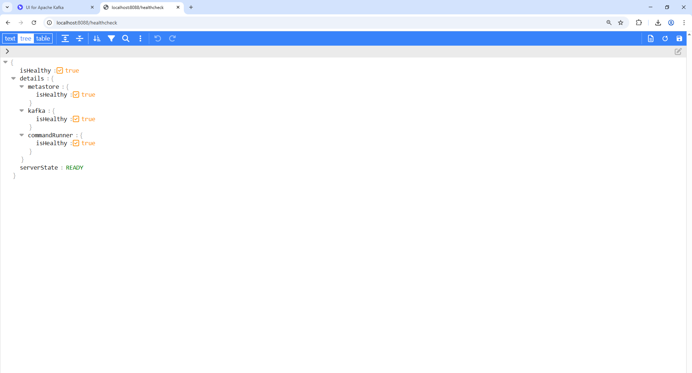
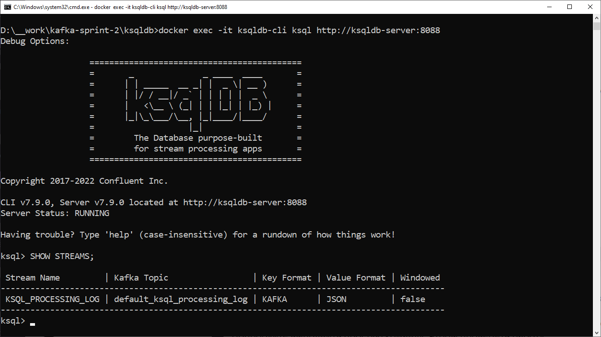

## Описание решения

В данном проекте мы реализуем систему анализа сообщений в реальном времени, используя ksqlDB для работы с потоковыми данными из Apache Kafka. Цель - создать аналитику для системы обмена сообщениями, где каждое сообщение представлено в JSON формате и содержит информацию об отправителе (`user_id`), получателе (`recipient_id`), тексте сообщения (`message`) и времени отправки (`timestamp`).  

### Общее описание проекта  

### Структура каталогов проекта  

```
ksqldb/
├── .gitattributes
├── .gitignore
├── .gradle/
├── build/
├── build.gradle
├── docker-compose.yml
├── Dockerfile
├── gradle/
│   └── wrapper/
│       ├── gradle-wrapper.jar
│       └── gradle-wrapper.properties
├── gradlew
├── gradlew.bat
├── README.md
├── settings.gradle
├── ksql/
│        └──ksqldb-queries.sql
└── src
  └── main
    ├── java
    │  └── com
    │    └── example
    │      └── ksqldb
    │        ├── KsqlDbApplication.java
    │        ├── config
    │        │  └── KafkaConfig.java
    │        ├── model
    │        │  └── Message.java
    │        └── service
    │          └── MessageProducerService.java
    └── resources
      └── application.yml
```


### Инфраструктура:  

Для начала, мы развернем необходимую инфраструктуру с помощью Docker Compose. Это включает в себя:  

•  Kafka: Центральный брокер сообщений, где хранятся все входящие сообщения и результаты агрегации.  
•  ZooKeeper: Сервис для управления Kafka.  
•  ksqlDB Server: Ядро нашей аналитической системы. ksqlDB Server будет подключен к Kafka и позволит нам выполнять потоковые SQL-запросы для анализа данных.  
•  ksqlDB CLI: Инструмент командной строки для взаимодействия с ksqlDB Server. Через CLI мы будем создавать потоки, таблицы и выполнять запросы.  
•  Kafka UI (Provectus UI): Веб-интерфейс для управления кластером Kafka, просмотра топиков и сообщений.  

Мы также определим два топика Kafka:  

•  `messages`: Для хранения входящих сообщений от пользователей.  
•  `user_statistics`: Для хранения агрегированной статистики по пользователям, полученной из ksqlDB.  

### Этапы реализации:  

1. Настройка Kafka Producer (Spring Boot приложение): Создаем Spring Boot приложение, которое будет генерировать сообщения в формате JSON и отправлять их в топик messages. Приложение будет использовать планировщик (scheduler) для автоматической генерации сообщений с заданной периодичностью.  

2. Создание потока `messages_stream` в ksqlDB: Используя ksqlDB CLI, мы создаем поток `messages_stream`, который будет читать данные из топика messages. При создании потока мы указываем схему данных (поля `user_id`, `recipient_id`, `message`, `timestamp`) и формат данных (JSON).  

3. Анализ сообщений в реальном времени (ksqlDB): Далее мы создаем таблицы ksqlDB для выполнения анализа в реальном времени:  

  •  `total_messages`: Подсчитывает общее количество отправленных сообщений.  
  •  `unique_recipients`: Подсчитывает количество уникальных получателей сообщений.  
  •  `top_users`: Определяет 5 наиболее активных пользователей по количеству отправленных сообщений. Эта таблица будет обновляться в реальном времени по мере поступления новых сообщений.  

4. Сбор статистики по пользователям (ksqlDB): Создаем таблицу `user_statistics` для агрегирования данных по каждому пользователю:  

  •  Подсчет количества сообщений, отправленных каждым пользователем.  
  •  Подсчет количества уникальных получателей для каждого пользователя.  
  •  Сохранение этой статистики в таблице `user_statistics`.  

  Чтобы оптимизировать запросы к таблице `user_statistics`, мы сначала создаем поток `messages_stream_rekeyed` путем повторного разделения (repartitioning) исходного потока `messages_stream` по `user_id`. Затем создаем таблицу `user_statistics_keyed` на основе этого потока. Это гарантирует, что все данные для конкретного пользователя будут находиться в одном разделе Kafka, что упрощает и ускоряет запросы, использующие `user_id` в качестве ключа.  
  
### Настройка  

1.  **Клонируйте репозиторий:**  

bash
```
    git clone <URL_репозитория>
    cd <каталог_проекта>
```

2. Соберите проект и запустите инфраструктуру Kafka с помощью Docker Compose:

```
bash
  docker-compose up --build
```

  Эта команда соберёт приложение и запустит следующие сервисы:  

  •  ZooKeeper (или Kraft Controller): Для управления метаданными Kafka.  
  •  Брокер Kafka: Центральный брокер сообщений. Он получает сообщения от производителя и делает их доступными для потребителей.  
  •  ksqlDB Server: Механизм потоковой обработки, который позволяет нам запрашивать топики Kafka, как если бы это были базы данных.  
  •  ksqlDB CLI: Интерфейс командной строки для взаимодействия с ksqlDB Server.  
  •  Kafka UI (Provectus UI): Веб-интерфейс для управления и мониторинга кластера Kafka. Он доступен по адресу http://localhost:8080.  

  Подождите, пока все сервисы запустятся. Вы можете проверить их статус с помощью docker ps. Инициализация Kafka и ksqlDB может занять несколько минут.  

3. ОТдельно можно собрать и запустить Spring Boot приложение, используя:  

```
bash
  ./gradlew bootRun
```

  Это приложение выступает в качестве производителя сообщений, генерируя смоделированные сообщения и отправляя их в топик messages Kafka. Оно автоматически запускается через фиксированный интервал, определенный в src/main/resources/application.yml.  

### Настройка топиков Kafka  

Прежде чем ksqlDB сможет обрабатывать сообщения, необходимо убедиться, что топик messages существует в Kafka. Spring Boot приложение и KafkaConfig.java должны автоматически создать его, но вы можете проверить или создать его вручную, используя Kafka UI или инструменты командной строки, если это необходимо.  

### Проверка с использованием Kafka UI:  

1. Откройте веб-браузер и перейдите по адресу http://localhost:8080.  
2. В Kafka UI перейдите в раздел "Топики".  
3. Убедитесь, что топик messages существует.  

Создание вручную с использованием инструментов командной строки Kafka (при необходимости):  

1. Войдите в контейнер Kafka:  

```
bash
  docker exec -it kafka bash
```

2. Создайте топик messages:  

```
bash
  kafka-topics --create --topic messages --partitions 6 --replication-factor 1 --bootstrap-server localhost:9092
```

  •  --topic messages: Указывает имя топика для создания.  
  •  --partitions 6: Устанавливает количество разделов для топика (настройте по мере необходимости для вашей рабочей нагрузки). Большее количество разделов обеспечивает больший параллелизм.  
  •  --replication-factor 1: Устанавливает коэффициент репликации (настройте по мере необходимости для отказоустойчивости). В производственной среде следует использовать коэффициент репликации больше 1.  
  •  --bootstrap-server localhost:9092: Указывает адрес брокера Kafka.  

3. Выйдите из контейнера Kafka:  

```
bash
  exit
```

### Настройка и запросы ksqlDB  

1. Подключитесь к ksqlDB CLI:  

```
bash
  docker exec -it ksqldb-cli ksql http://ksqldb-server:8088
```

  Это откроет интерактивную оболочку ksqlDB.  

2. Выполните запросы ksqlDB:  

  Скопируйте содержимое файла ksqldb-queries.sql и вставьте его в ksqlDB CLI. Это создаст необходимые потоки и таблицы для анализа сообщений. Запросы:  

  •  `CREATE STREAM messages\_stream`: Создает поток из топика Kafka messages, определяя схему данных (`user\_id`, `recipient\_id`, `message`, `timestamp`) и формат (JSON).  
  •  `CREATE TABLE total\_messages`: Создает таблицу, которая непрерывно подсчитывает общее количество полученных сообщений.  
  •  `CREATE TABLE unique\_recipients`: Создает таблицу, которая подсчитывает количество уникальных получателей сообщений.  
  •  `CREATE TABLE top\_users`: Создает таблицу, которая определяет 5 самых активных пользователей на основе количества отправленных ими сообщений. Предложение EMIT CHANGES гарантирует, что эта таблица будет обновляться в режиме реального времени.  
  •  `CREATE STREAM messages\_stream\_rekeyed`: Создает поток с переназначенным ключом, используя предложение PARTITION BY user_id из топика messages. Это гарантирует, что все сообщения для одного и того же пользователя обрабатываются одним и тем же узлом ksqlDB.  
  •  `CREATE TABLE user\_statistics\_keyed`: Создает таблицу с агрегированной статистикой для каждого пользователя (количество отправленных сообщений и количество уникальных получателей). Эта таблица строится на основе потока с переназначенным ключом для оптимальной агрегации.  

(см. [ksql/ksqldb-queries.sql](ksql/ksqldb-queries.sql))

```
sql
-- Создаем поток из топика messages
CREATE STREAM messages_stream (
    user_id VARCHAR KEY,
    recipient_id VARCHAR,
    message VARCHAR,
    timestamp BIGINT
) WITH (
    KAFKA_TOPIC = 'messages',
    VALUE_FORMAT = 'JSON'
);

-- Таблица: Общее количество отправленных сообщений
CREATE TABLE total_messages AS
SELECT
    COUNT(*) AS total_count
FROM messages_stream
GROUP BY NULL; -- Нужно использовать GROUP BY NULL для агрегатов без группировки по столбцам

-- Таблица: Количество уникальных получателей сообщений
CREATE TABLE unique_recipients AS
SELECT
    COUNT(DISTINCT recipient_id) AS unique_count
FROM messages_stream
GROUP BY NULL; -- Группируем по NULL для агрегата без группировки по другим полям

-- Создание таблицы: Топ-5 активных пользователей
CREATE TABLE top_users AS
SELECT
    user_id,
    COUNT(*) AS message_count
FROM messages_stream
GROUP BY user_id
HAVING ROW_NUMBER() OVER (PARTITION BY user_id ORDER BY COUNT(*) DESC) <= 5;

-- Таблица: Статистика пользователей
CREATE TABLE user_statistics AS
SELECT
    user_id,
    COUNT(*) AS sent_messages,
    COUNT(DISTINCT recipient_id) AS unique_recipients
FROM messages_stream
GROUP BY user_id;

-- Создание нового потока: сообщения, перехваченные для агрегации
CREATE STREAM messages_stream_rekeyed AS
SELECT *
FROM messages_stream
PARTITION BY user_id; -- Здесь вы можете перезаписать ключи, создавая новый поток на основе существующего.

-- Таблица: Статистика пользователей с оптимизацией для доступа по ключу
CREATE TABLE user_statistics_keyed AS
SELECT
    user_id,
    COUNT(*) AS sent_messages,
    COUNT(DISTINCT recipient_id) AS unique_recipients
FROM messages_stream_rekeyed
GROUP BY user_id;
```

### Тестирование и проверка  

Spring Boot приложение будет автоматически генерировать и отправлять сообщения в топик messages. Чтобы убедиться, что система работает правильно, вы можете использовать следующие методы:  

1. Проверьте генерацию сообщений в Kafka UI:  

  •  Откройте Kafka UI по адресу http://localhost:8080.  
  •  Перейдите в раздел "Топики" и выберите топик messages.  
  •  Просмотрите сообщения в топике, чтобы убедиться, что они генерируются Spring Boot приложением.  

2. Выполните тестовые запросы в ksqlDB CLI:  

  Запустите следующие SQL-запросы в ksqlDB CLI для получения и проверки агрегированных данных:  

  •  Общее количество отправленных сообщений:  

```
sql
    SELECT * FROM total_messages;
```

  •  Количество уникальных получателей:  

```
sql
    SELECT * FROM unique_recipients;
```

  •  Топ 5 самых активных пользователей (обновления в реальном времени):  

```
sql
    SELECT * FROM top_users;
```

    Этот запрос отобразит 5 лучших пользователей на основе количества отправленных ими сообщений. По мере обработки новых сообщений результаты будут автоматически обновляться.  

  •  Статистика пользователя для конкретного пользователя:  

```
sql
    SELECT × FROM user_statistics_keyed WHERE user_id = 'замените_на_действительный_user_id';
```
        Замените 'замените_на_действительный_user_id' на действительный user_id из сгенерированных сообщений. Для расчета статистики после создания нового user_id может потребоваться несколько секунд.  

## Конфигурация  

Следующие параметры конфигурации можно настроить в соответствующих файлах:  

•   [resources/application.yml](./src/main/resources/application.yml) (Spring Boot):  
    *   `kafka.bootstrap-servers`: Адрес брокера Kafka.  
    *   `kafka.topic.messages`: Имя входного топика.  
    *   `message.generation.interval`: Интервал (в миллисекундах), через который Spring Boot приложение генерирует сообщения.  

•   **docker-compose.yml:**  
    *   Переменные среды для серверов Kafka и ksqlDB, такие как `KSQLDB_BOOTSTRAP_SERVERS`, `KAFKA_ADVERTISED_LISTENERS` и другие конфигурации Kafka.  
    *   Порты, открытые для каждого сервиса.  

### Журналирование и мониторинг  

При успешной работе/настройке, старте приложения (всех сервисов) можем видеть (для Windows, Docker Compose)  

Успешный вывод при старте KsqlDb-сервера (healthcheck):  



Успешный вывод при запуске и входе в KsqlDb-консоль:  


